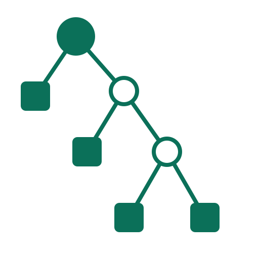
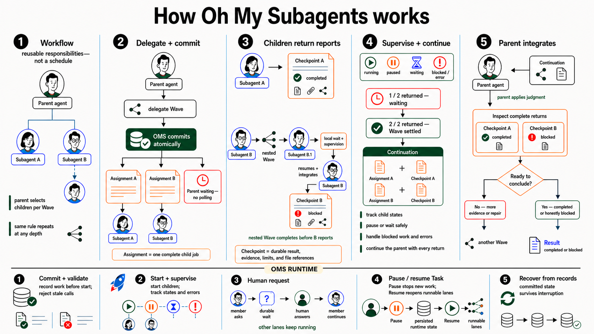
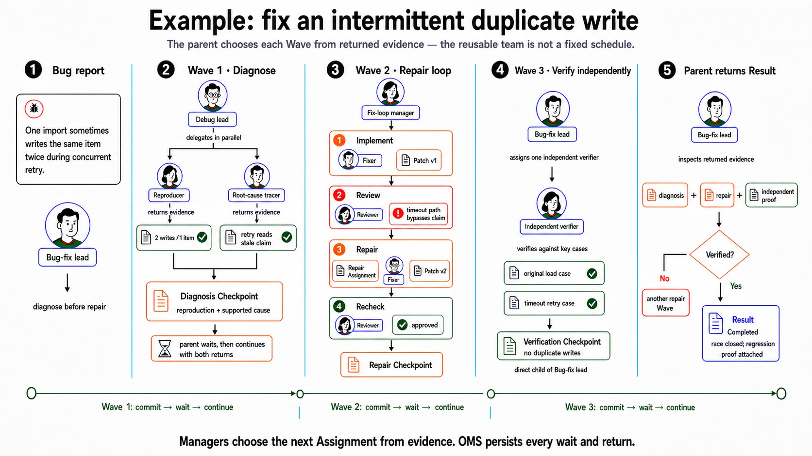

<p align="center">  </p>

<h1 align="center">Oh My Subagents</h1>

<p align="center"><strong>Turn ad-hoc subagents into durable, accountable AI teams.</strong></p>

<p align="center">A local runtime for persistent, supervised parent–subagent delegation with Codex and Claude.</p>

<p align="center"> <a href="https://pypi.org/project/oh-my-subagents/"></a> <a href="https://pypi.org/project/oh-my-subagents/"></a> </p>

<p align="center"> <a href="docs/start/getting-started.md">Get started</a> · <a href="docs/README.md">Documentation</a> · <a href="examples/workflows/README.md">Starter teams</a> </p>

<p align="center">  </p>

<p align="center"><a href="https://www.youtube.com/watch?v=-prDEZYpx9M"><strong>▶ Watch the tutorial</strong></a></p>

## 🚀 Stop babysitting subagents

Ad-hoc delegation is easy to begin and surprisingly hard to operate. A parent spawns children, polls them, reconstructs ownership from chat, and hopes that a closed terminal or interrupted provider session did not erase the only useful account of what happened.

Oh My Subagents moves that coordination into durable runtime state:

| Ad-hoc subagents                              | Oh My Subagents                                                                      |
| --------------------------------------------- | ------------------------------------------------------------------------------------ |
| Recreate roles and prompts for every job      | Publish a reusable tree of named responsibilities                                    |
| Keep asking whether every child is done       | Let the runtime persist the wait, collect the complete Wave, and continue the parent |
| Reconstruct ownership from a transcript       | Follow controller-owned team, Activity, and wait state                               |
| Treat provider completion as success          | Accept only the Task lead's completed or blocked Result                              |
| Recover by piecing together terminal sessions | Recover from committed controller records without discarding accepted history        |
| Relay giant responses through chat            | Hand off concise Checkpoints and explicit references to ordinary workspace files     |

## ⚙️ How it works

When a Manager delegates a Wave, **Oh My Subagents (OMS)** commits the child Assignments, persists the parent wait, supervises every return, and continues the parent with the complete Checkpoints—even after an interruption.



The parent does not remain in a polling loop. A delegated Wave and its child Assignments commit together with the parent wait. Children return terminal Checkpoints independently; the controller collects the complete Wave and continues the parent with every return.

Managers can delegate recursively. Every Manager follows the same local rule with its direct children: delegate, wait, inspect the complete returns, and integrate. Deeper teams need no hidden global polling loop.

## 🧪 A concrete bug-fix run

Here is one concrete run: evidence determines the next Wave, review findings become a new repair Assignment, and verification remains independent.



## 🧠 Reuse responsibility—not a frozen schedule

A **Workflow definition** answers **who is responsible**. It does not prescribe when a Member runs or force the work into a DAG.

At runtime, Managers choose the pattern that fits the actual Task and current evidence:

- run dependent work sequentially;
- fan independent work out in parallel;
- iterate through implement, review, and repair;
- divide a bounded batch among reusable owners;
- combine those patterns in one Task; or
- replan one responsibility subtree when the current team no longer fits.

The same published team can therefore respond differently to two different missions. A replan changes future responsibility without rewriting earlier revisions, completed work, or accepted history.

## 🧾 Accountability is a runtime contract

OMS does more than display several agents at once:

- **One stable starting contract.** Every Task pins the exact published Workflow revision it started with.
- **One owner per Assignment.** Child work is immutable, task-specific, and tied to the Member responsible for returning it.
- **Durable fan-out and fan-in.** Waves, waits, retries, replans, Checkpoints, and continuations live in controller-owned state—not only in a provider transcript.
- **One accountable Result.** Child completion is evidence for a parent. Only the Task lead's accepted completed or blocked Checkpoint becomes the Result shown to you.
- **Honest recovery.** Browser closure, provider interruption, and controller restart do not silently fabricate completion or discard accepted history.
- **Ordinary files stay ordinary.** Notes, reports, code, and artifacts remain in your workspace. OMS records small navigation references instead of pretending to own or snapshot every byte.

Capabilities deny by default and never inherit from a parent. Provider, model, sandbox, Human Request, and managed Command Run choices stay explicit where a team needs them without becoming mandatory ceremony for every Workflow.

## 🎛️ Design and operate visually

The visual Console is the primary experience:

- **Workflow library** keeps reusable teams, drafts, and published revisions together.
- **Workflow Studio** lets you shape the complete responsibility hierarchy on a horizontal canvas, validate it, and publish deliberately.
- **Run Studio** shows the live team, current plans, meaningful Activity, Human Requests, managed Actions, referenced files, and the exact completed or blocked Result.
- **Steering** delivers bounded new context to one exact active Member without pretending earlier work or tool effects never happened.

Prefer conversation? The separate **Operator** can draft and revise Workflows, explain teams, publish when asked, start and control Runs, answer Human Requests, and inspect managed Actions. Operator and the visual interface call the same controller-owned operations, so chat never creates a second hidden copy of product truth.

## ⚡ Install and start

Oh My Subagents requires Python 3.12 or newer and supports Linux, macOS 13+, and Windows 11 x64. Install it in an isolated environment with [pipx](https://pipx.pypa.io/stable/):

```bash
pipx install oh-my-subagents
oms init
oms service install
```

Open `http://127.0.0.1:18125/`.

Guided initialization selects a default workspace, configures a Codex or Claude Task provider, publishes the Starter teams, and can configure the separate Operator. SQLite is the default, so a local installation needs no database server.

### Keep the controller running

`oms service install` verifies the configuration and database schema, installs a native per-user background service, and starts it. The controller keeps supervising work after you close the terminal and returns at login.

```bash
oms service status
oms service restart
oms service logs --lines 200
oms service stop
```

Linux uses a systemd user service, macOS a current-user LaunchAgent, and Windows a current-user Scheduled Task. `oms service uninstall` removes the native service definition while preserving configuration, database, and provider credentials. Use `oms serve` when you prefer the portable foreground path.

### Optional PostgreSQL

Install the optional driver and provide a SQLAlchemy URL during initialization:

```bash
pipx install "oh-my-subagents[postgres]"
oms init \
  --database-url "postgresql+asyncpg://oms@127.0.0.1/oms"
```

See [Getting started](docs/start/getting-started.md) for provider prerequisites and a complete first run, or [Database configuration](docs/reference/configuration.md#database) for PostgreSQL permissions, schemas, and environment overrides.

## 🧰 Choose a Starter Workflow

`oms init` publishes eight provider-neutral Starters. Choose one when a mission is consequential or broad enough that independent ownership, durable work, or adversarial verification adds real value:

| Starter                                 | Use it when                                                                                                                  |
| --------------------------------------- | ---------------------------------------------------------------------------------------------------------------------------- |
| `production-feature-delivery`           | A feature crosses contracts, implementation boundaries, integrated verification, and release readiness.                      |
| `incident-investigation-and-recovery`   | A serious or intermittent failure needs competing hypotheses, supported recovery, verification, and prevention.              |
| `migration-and-modernisation`           | A large migration needs inventory, dependency-aware batches, cutover, and stale-path removal.                                |
| `deep-research-and-decision-brief`      | A consequential question needs independent evidence, claim verification, and one accountable recommendation.                 |
| `decision-through-competing-prototypes` | Alternatives should be tested under one fair rubric instead of decided from prose alone.                                     |
| `idea-to-validated-demo`                | A product idea should become an evidence-backed position, working first demo, launch strategy, and credible pitch.           |
| `experiment-and-replication-program`    | An empirical or computational program needs explicit methods, durable execution, independent replication, and claim audit.   |
| `security-audit-and-hardening`          | A security program needs attack-surface mapping, specialised audits, validated remediation, and adversarial re-verification. |

The [Starter catalog](examples/workflows/README.md) includes example missions, expected deliverables, and guidance on when a simpler team is better. A one-Member Workflow is valid—and usually wiser—when delegation would add ceremony without independent evidence, useful specialization, or real integration.

## 🧭 From prompt to Result

1. **Choose or design a team.** Start from an included Starter Workflow or shape a responsibility tree in Workflow Studio.
2. **Publish a stable revision.** Every Run keeps the exact team contract it started with.
3. **Give the lead one complete prompt.** Managers plan, delegate, adapt, and integrate while OMS supervises runtime state.
4. **Stay involved where judgment matters.** Steer an active Member or answer a typed Human Request when the team genuinely needs you.
5. **Receive the accountable Result.** Read the lead's exact completed or blocked outcome and follow its references into detailed workspace files.

## 📚 Documentation

- [Get started](docs/start/getting-started.md)
- [Understand Workflows and teams](docs/concepts/workflows-and-teams.md)
- [Author a Workflow](docs/guides/author-a-workflow.md)
- [Run and operate work](docs/guides/run-and-operate.md)
- [Use the Console and Operator](docs/guides/console-and-operator.md)
- [Migrate from Banksia](docs/guides/migrate-from-banksia.md)
- [Configure the runtime](docs/reference/configuration.md)
- [Troubleshoot an installation](docs/help/troubleshooting.md)
- [Contribute](CONTRIBUTING.md)
- [Report an issue](https://github.com/ringlochid/oh-my-subagents/issues)

## ⚖️ License

Oh My Subagents is open source under the [MIT License](LICENSE), except for the visual Console in [`console/`](console/), which contains material derived from n8n and is distributed under the [Sustainable Use License](console/LICENSE). That license permits internal business, non-commercial, and personal use; redistribution is limited to free, non-commercial distribution. See the [Console notice](console/NOTICE) for attribution and the modification notice.
