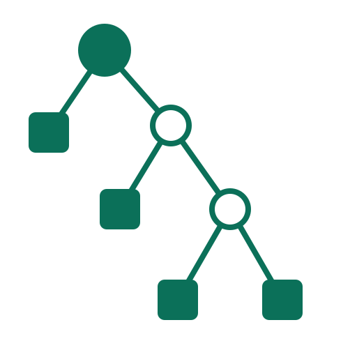

<p align="center">  </p>

<h1 align="center">Banksia</h1>

<p align="center"><strong>Accountable AI teams for complex work.</strong></p>

<p align="center"> <a href="docs/start/getting-started.md">Get started</a> · <a href="docs/README.md">Documentation</a> · <a href="examples/workflows/README.md">Workflow examples</a> </p>

## Turn subagent workflows into accountable AI teams

Banksia is a no-code AI-team runtime for developers, researchers, and anyone who uses multiple agents to complete complex work accountably.

You operate Banksia as a product rather than embed it as an agent SDK; the controller owns published teams, run state, and completion.

Design reusable responsibilities without hard-coding how the work unfolds. Give the team one complete prompt, follow meaningful progress, respond when a real decision needs you, and receive one exact Result.

## From ad-hoc subagents to a reusable team

| Ad-hoc subagents                              | Banksia                                                                                |
| --------------------------------------------- | -------------------------------------------------------------------------------------- |
| Recreate roles and prompts for every job      | Publish a reusable tree of named responsibilities                                      |
| Reconstruct ownership from a transcript       | Follow controller-owned team, activity, and wait state                                 |
| Treat provider completion as the outcome      | Accept only the lead's exact `green` or `blocked` Result                               |
| Recover by piecing together terminal sessions | Recover from durable controller records; keep deliverables in ordinary workspace files |

Banksia gives you:

- explicit responsibility and delegation boundaries;
- sequential, parallel, iterative, batch, or hybrid work chosen from current evidence;
- independent implementation, research, criticism, and verification roles;
- typed human decisions and managed command activity when explicitly granted; and
- one inspectable Result with direct references to the files that carry the detailed work.

## Get to a first Result

Banksia is not yet published to a package registry. Use a clean source checkout with Python 3.12 or newer, Make, and a supported Node.js/npm installation:

```bash
git clone https://github.com/ringlochid/banksia.git
cd banksia
make backend-install
make console-install
make console-package-assets
./.venv/bin/banksia init
./.venv/bin/banksia serve
```

`make console-package-assets` prepares the visual Console served by the source checkout. `banksia init` prepares local controller state, asks for one Task provider, and offers the separate Operator as an optional final choice. Rerun `banksia setup` later to change Task providers, Operator, or the default workspace.

Open `http://127.0.0.1:18125/`, go to **Runs**, and start a run with the `production-feature-delivery` Starter:

> Add a guided configuration-import recovery experience across the API and
> Console. Preserve accepted imports, define the shared error contract, implement
> the service and user-facing behavior, verify the integrated recovery path,
> repair consequential findings, and return the release-readiness result with
> referenced files.

Watch who owns the work, read meaningful Activity, then read the exact Result and open its referenced files in your workspace. The [getting-started guide](docs/start/getting-started.md) includes the complete developer path and a researcher path using `deep-research-and-decision-brief`.

## Start with a team

`banksia init` publishes eight provider-neutral Starters. Choose by the difficulty that makes one agent insufficient:

| Starter                                 | Choose it for                                                                                                                           |
| --------------------------------------- | --------------------------------------------------------------------------------------------------------------------------------------- |
| `production-feature-delivery`           | A consequential feature crossing contracts, implementation boundaries, integrated verification, and release readiness.                  |
| `incident-investigation-and-recovery`   | An intermittent or high-impact failure needing competing hypotheses, supported recovery, independent verification, and prevention.      |
| `migration-and-modernisation`           | A large migration needing inventory, dependency-aware batches, cutover, and stale-path removal.                                         |
| `deep-research-and-decision-brief`      | A broad, consequential question needing independent evidence, claim verification, and one accountable recommendation.                   |
| `decision-through-competing-prototypes` | A choice that should be tested through alternatives under one fair rubric instead of decided from prose alone.                          |
| `idea-to-validated-demo`                | A product idea that should become an evidence-backed position, working first demo, launch strategy, and credible pitch.                 |
| `experiment-and-replication-program`    | A substantial empirical or computational program needing explicit methods, durable execution, independent replication, and claim audit. |
| `security-audit-and-hardening`          | A security program needing attack-surface mapping, specialised audits, validated remediation, and adversarial re-verification.          |

These are not eight aliases for “implement and review.” Each team exists because parallel breadth, independent judgment, durable work, or evaluator-driven repair can materially improve the outcome. The complete [Workflow catalog](examples/workflows/README.md) includes sample missions, expected deliverables, and guidance on when a simpler Workflow is better.

## The product loop

**Design → Publish → Run → Respond → Result**

1. **Design** a Workflow definition as a tree of responsibilities, not a timed sequence.
2. **Publish** an immutable revision so every run has a stable team contract.
3. **Run** that revision with one prompt, one workspace, and optional file references.
4. **Respond** only when an explicitly capable Member opens a Human Request, or control the run when a current action is legal.
5. **Result** is the lead's exact final `green` or `blocked` Checkpoint, with referenced files for detailed deliverables.

## Current scope

- Banksia runs as one loopback-bound process and is local-tool-first.
- `banksia serve` is the foreground path. `banksia service install` selects a systemd user service on Linux or a current-user LaunchAgent on macOS.
- Codex and Claude are managed providers. OpenClaw is a compatibility transport that you configure and operate.
- A run uses one shared provider-visible workspace. Per-Member isolation and automatic merging are not current product behavior.
- Human Request and Command Run capabilities deny by default. Revised Starters grant them only to the Members whose responsibility intrinsically needs a user decision or a long supervised process; capabilities never inherit.
- File references record a workspace-relative path and optional description, not a snapshot. A referenced file can later change or disappear.
- External MCP servers, reusable Skills, distributed delivery, and broad multi-user operation are deferred.
- The Console supports the current authoring and operating paths and is currently desktop-oriented. Mature visual design and mobile/tablet experiences are deferred.
- The native controller/runtime targets Linux and macOS. Linux is the currently evidenced source-development path; macOS release support still requires its native installed-wheel gate. Native Windows is deferred; WSL2 uses the Linux path.

## Learn more

- [Choose a guide by intent](docs/README.md)
- [Understand Workflows and teams](docs/concepts/workflows-and-teams.md)
- [Author a Workflow](docs/guides/author-a-workflow.md)
- [Run and operate work](docs/guides/run-and-operate.md)
- [Use the Console and Operator](docs/guides/console-and-operator.md)
- [Troubleshoot an installation](docs/help/troubleshooting.md)
- [Contribute to Banksia](CONTRIBUTING.md)
- [Report an issue](https://github.com/ringlochid/banksia/issues)

Banksia is open source under the [MIT License](LICENSE), except for the visual Console in [`console/`](console/), which contains material derived from n8n and is distributed under the [Sustainable Use License](console/LICENSE). That license limits use to internal business purposes or non-commercial or personal use, and permits redistribution only free of charge for non-commercial purposes. See [`console/NOTICE`](console/NOTICE) for attribution and the modification notice.
